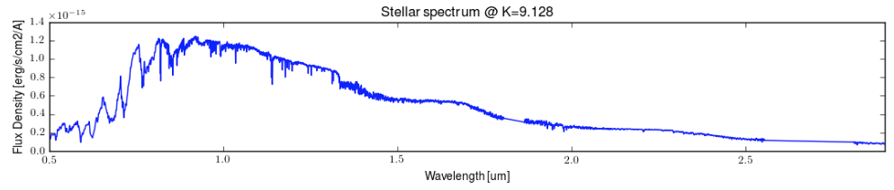
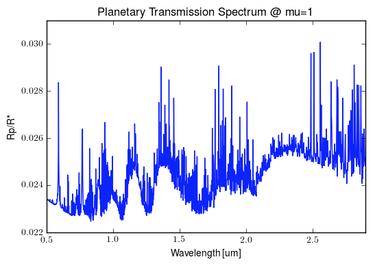

# AWESim SOSS

### Analyzing Webb Exoplanet Simulations with SOSS

Author: Joe Filippazzo

This pure Python module produces simulated data for the Single Object Slitless Spectroscopy (SOSS) mode of the NIRISS instrument onboard the James Webb Space Telescope.

### Dependencies
The following packages are needed to run `AWESim_SOSS`:
- numpy
- batman
- astropy

### Usage

Given a time axis and a 1D spectrum of a target, this module produces a 2D SOSS slope image for each point on the time axis. For example, if I want to produce 200 integrations of an M4 dwarf as seen through SOSS, my code might look like:

```
import numpy as np
from AWESim_SOSS import awesim
t = np.linspace(-0.2, 0.2, 200)
spec = np.genfromtxt('data/m4v_combined_template.txt', unpack=True)
TSO2 = awesim.TSO(t, spec)
TSO2.plot_frame()
```

Here is the input spectrum and one frame of the output data cube:




The example above was for an isolated star though. To include a planetary transit we must additionally provide:

- A transmission spectrum of the planet
- A map of the limb darkening coefficients at each pixel
- The orbital parameters of the planet

Here is a sample transmission spectrum generated with PANDEXO:



And here are some orbital parameters for WASP-107:

```
import batman
params = batman.TransitParams()
params.t0 = 0.                                # time of inferior conjunction
params.per = 5.7214742                        # orbital period
params.a = 0.0558*q.AU.to(ac.R_sun)*0.66      # semi-major axis (in units of stellar radii)
params.inc = 89.8                             # orbital inclination (in degrees)
params.ecc = 0.                               # eccentricity
params.w = 90.                                # longitude of periastron (in degrees)
```