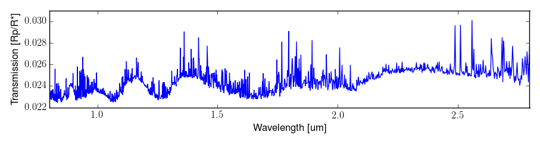

==========
awesimsoss
==========

.. image:: https://img.shields.io/github/v/release/spacetelescope/awesimsoss?label=awesimsoss
        :alt: GitHub release
        :target: https://github.com/spacetelescope/awesimsoss/releases

.. image:: https://img.shields.io/travis/spacetelescope/awesimsoss.svg
        :target: https://travis-ci.org/spacetelescope/awesimsoss.svg?branch=master

.. image:: https://readthedocs.org/projects/awesimsoss/badge/?version=latest
        :target: https://awesimsoss.readthedocs.io/en/latest/?badge=latest
        :alt: Documentation Status

.. image:: https://coveralls.io/repos/github/spacetelescope/awesimsoss/badge.svg
        :target: https://coveralls.io/github/spacetelescope/awesimsoss

.. image:: https://zenodo.org/badge/115032914.svg
        :target: https://zenodo.org/badge/latestdoi/115032914

Advanced Webb Exposure SIMulator for SOSS
~~~~~~~~~~~~~~~~~~~~~~~~~~~~~~~~~~~~~~~~~

Authors: Joe Filippazzo, Nestor Espinoza, Kevin Volk, Jonathan Fraine, Michael Wolfe

This pure Python 3.6+ package produces simulated time-series data for the `Single
Object Slitless Spectroscopy (SOSS) <https://jwst-docs.stsci.edu/display/JTI/NIRISS+Single+Object+Slitless+Spectroscopy>`_ mode of the NIRISS instrument
onboard the James Webb Space Telescope.

Additional resources:

- `Full documentation <https://awesimsoss.readthedocs.io/en/latest/>`_
- `Jupyter notebook <https://github.com/spacetelescope/awesimsoss/blob/master/notebooks/awesimsoss_demo.ipynb>`_
- `Build history <https://travis-ci.com/hover2pi/awesimsoss>`_

Installation
~~~~~~~~~~~~

The best way to install ``awesimsoss`` is

.. code-block:: bash

   conda install -c jfilippazzo awesimsoss

You can also do it with

.. code-block:: bash

   git clone https://github.com/spacetelescope/awesimsoss.git
   cd awesimsoss
   conda env create --name awesimsoss -f environment.yml
   conda activate awesimsoss
   python setup.py develop

Simulating SOSS Observations
~~~~~~~~~~~~~~~~~~~~~~~~~~~~

Given a 1D spectrum of a target, this package produces 2D SOSS ramp
images for the specified number of groups and integrations. For example, if
I want to produce 5 integrations of 3 groups each for a J=9 A0 star as
seen through SOSS, my code might look like:

.. code-block:: python

   # Imports
   from awesimsoss import TSO
   from hotsoss import STAR_DATA

   # Initialize simulation
   tso256_clear = TSO(ngrps=3, nints=5, star=STAR_DATA)
               
   # Run it and make a plot
   tso256_clear.simulate()
   tso256_clear.plot()

.. figure:: awesimsoss/img/plot_frames.png
   :alt: The output trace

The `plot` method generates an interactive figure of counts, SNR, and saturation
values for the entire exposure as well as the wavelength value at each pixel for
each order and a slider to inspect each frame in the cross dispersion direction.

The `SUBSTRIP256` subarray is the default but the `SUBSTRIP96` subarray and
`FULL` frame configurations are also supported:

.. code-block:: python

   tso96_clear = TSO(ngrps=3, nints=5, star=STAR_DATA, subarray='SUBSTRIP96')
   tso2048_clear = TSO(ngrps=3, nints=5, star=STAR_DATA, subarray='FULL')

The default filter is `CLEAR` but you can also simulate observations with
the `F277W` filter like so:

.. code-block:: python

   tso256_f277w = TSO(ngrps=3, nints=5, star=STAR_DATA, filter='F277W')

Simulated Planetary Transits
~~~~~~~~~~~~~~~~~~~~~~~~~~~~

The example above was for an isolated star. To include a
planetary transit we must additionally provide a transmission spectrum
and the orbital parameters of the planet.

Here is a sample transmission spectrum generated with `PandExo <https://github.com/natashabatalha/PandExo>`_:

.. code-block:: python

   from hotsoss import PLANET_DATA

And here are some orbital parameters for our planetary system using `batman <https://www.cfa.harvard.edu/~lkreidberg/batman/>`_:

.. code-block:: python

   # Simulate star with transiting exoplanet by including transmission spectrum and orbital params
   import batman
   tso_transit = TSO(ngrps=3, nints=5, star=STAR_DATA)
   params = batman.TransitParams()
   params.t0 = 0. # time of inferior conjunction
   params.per = 5.7214742 # orbital period (days)
   params.a = 7.92 # semi-major axis (in units of stellar radii)
   params.rp = 0.1 # radius ratio for Jupiter orbiting the Sun
   params.inc = 89.8 # orbital inclination (in degrees)
   params.ecc = 0. # eccentricity
   params.w = 90. # longitude of periastron (in degrees) p
   params.limb_dark = 'quadratic' # limb darkening profile to use
   params.u = [0.1,0.1] # limb darkening coefficients

   tmodel = batman.TransitModel(params, tso_transit.time)
   tmodel.teff = 3500 # effective temperature of the host star
   tmodel.logg = 5 # log surface gravity of the host star
   tmodel.feh = 0 # metallicity of the host star

Now the code to generate a simulated planetary transit around our star might look like:

.. code-block:: python

   tso_transit.simulate(planet=PLANET_DATA, tmodel=tmodel)
   tso_transit.plot_lightcurve()

We can write this to a FITS file directly ingestible by the JWST pipeline with:

.. code-block:: python

   tso_transit.export('my_SOSS_simulation.fits')
